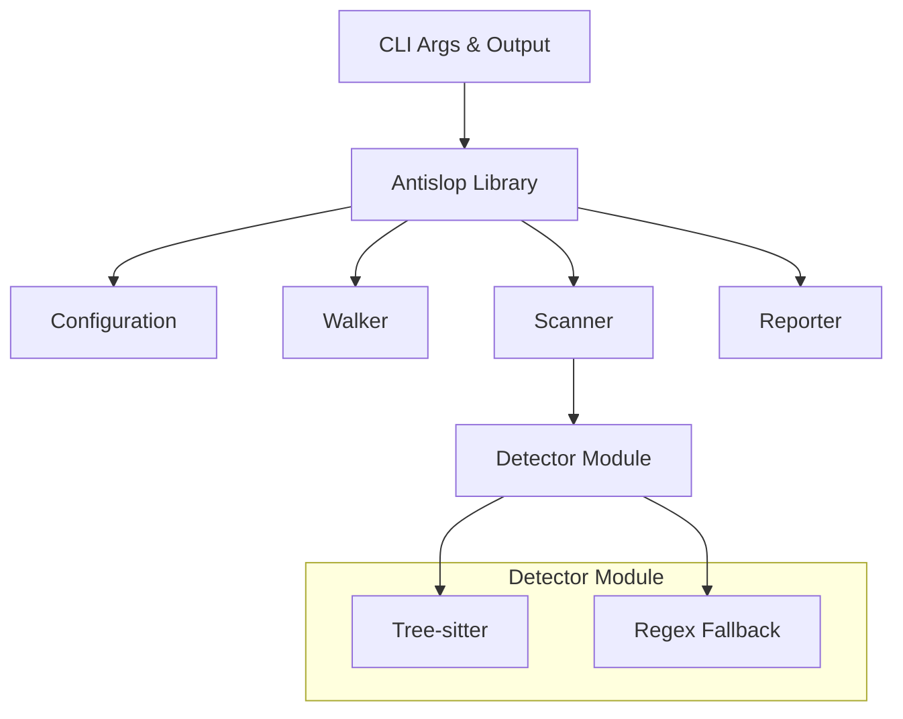

# Architecture

## Overview

Antislop is built as a library with a CLI binary, enabling programmatic use and extensibility.

## Modules

### `walker`
Parallel file traversal with gitignore support using the `ignore` crate.

### `detector`
Core detection engine with:
- Pattern registry and compilation
- Tree-sitter integration for accurate comment extraction (13+ languages)
- AST-level slop detection via tree-sitter queries
- Regex fallback for languages without tree-sitter support
- Language detection from file extensions

### `config`
Configuration management with TOML support and layered defaults.

### `report`
Output formatting with human-readable colored terminal output, JSON export, and SARIF for GitHub Security.

## Quality Assurance Strategy

Antislop uses a **MECE (Mutually Exclusive, Collectively Exhaustive)** strategy with tools like MegaLinter.
- **Hygiene Test**: `scripts/check_overlap.py` ensures no pattern overlaps with standard linter defaults.
- **Goal**: Antislop only flags "AI Slop" (intent/laziness), leaving syntax/style to specialized tools.

## Language Support

| Language | Tree-sitter | Regex Fallback | Feature Flag |
|----------|-------------|----------------|--------------|
| C/C++ | ✓ | ✓ | `cpp` |
| C# | ✓ | ✓ | `c-sharp` |
| Go | ✓ | ✓ | `go` |
| Haskell | ✓ | ✓ | `haskell` |
| Java | ✓ | ✓ | `java` |
| JavaScript | ✓ | ✓ | `javascript` |
| Kotlin | ✗ | ✓ | — |
| Lua | ✓ | ✓ | `lua` |
| Perl | ✗ | ✓ | — |
| PHP | ✗ | ✓ | — |
| Python | ✓ | ✓ | `python` |
| R | ✗ | ✓ | — |
| Ruby | ✓ | ✓ | `ruby` |
| Rust | ✓ | ✓ | `rust` |
| Scala | ✓ | ✓ | `scala` |
| Shell | ✗ | ✓ | — |
| Swift | ✗ | ✓ | — |
| TypeScript | ✓ | ✓ | `typescript` |
